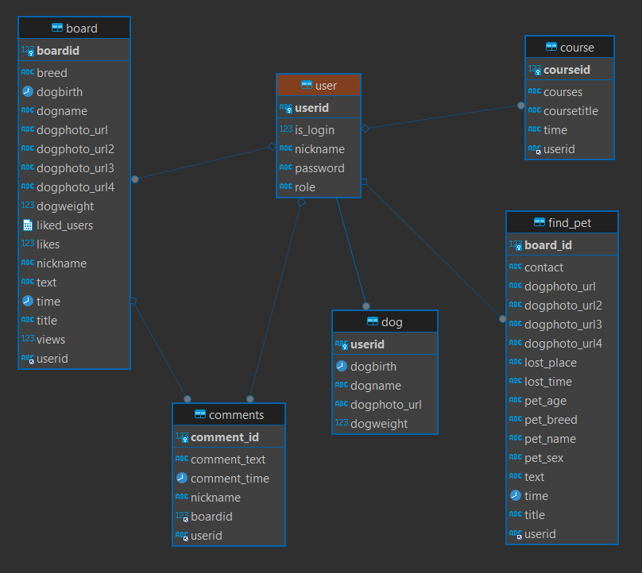
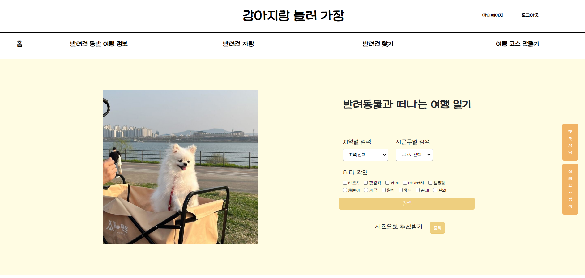
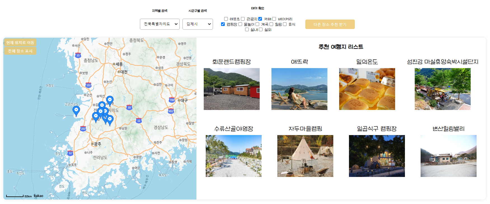
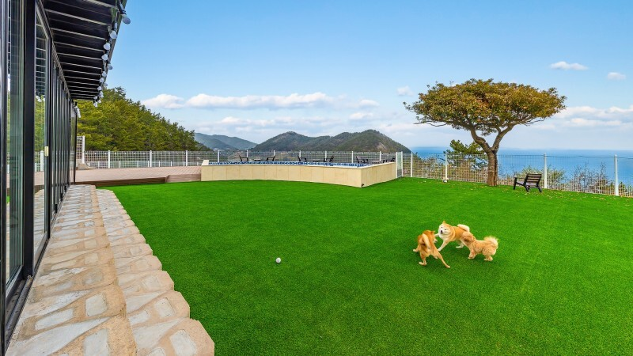
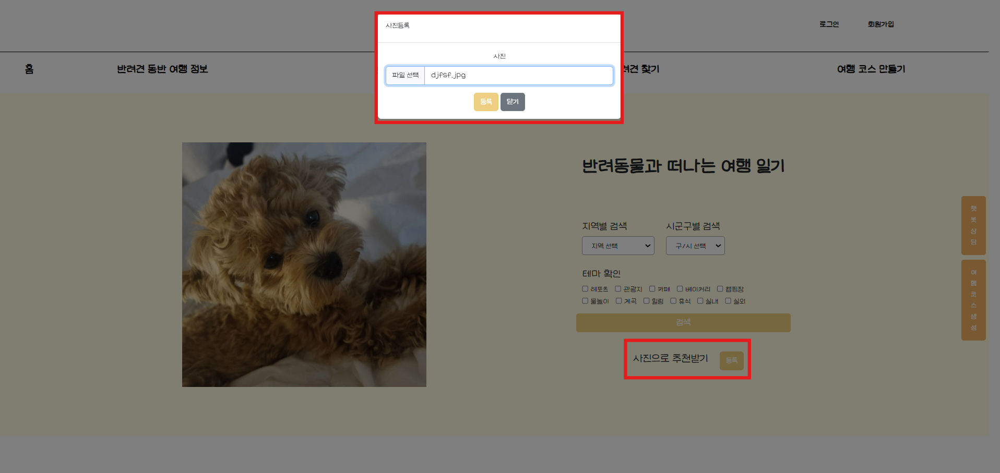

  
  <h4>⭐🍒CHERRY-KONG🫛⭐</h4>

---

<h2>기획 배경</h2>

- 늘어나는 국내 반려인구
- 한국농촌경제연구원 자료에 
따르면 반려동물 시장규모는  연평균 14.5%씩 성장하고 있고 관련업체 수도 증가하고 있음
- 이에 따라 반려견과 함께하는 여행의 수요도 늘어남
- 하지만 반려견과 함께하는 여행을 계획할 때 반려동물 동반이 가능한 여행지나 식당, 카페 등을 선별하는 번거로움이 있음
- 따라서 반려견 동반 여행지 추천 시스템을 기획하게 됨.

<h2>프로젝트 소개</h2>

<b>[ 반려견 동반 여행지 추천 시스템 ]</b>
1. 태그기반: 사용자에게 지역(시군구), 테마를 입력받아 이를 기반으로 여행지를 추천

2. 이미지 기반: 사용자가 선호하는 여행지 사진을 입력받아 해당 이미지와 유사한 여행지를 추천
- 완성된 여행코스는 마이페이지에 저장하거나 인쇄 가능하게 함

<h2>ERD</h2>

<h2>기능(페이지) 소개</h2>

| 번호 | 카테고리 | 세부내용 |
|------|----------|----------|
| 1    | 회원 (로그인, 회원가입)  | - 회원가입: 아이디, 비밀번호, 닉네임 입력 - 로그인: 아이디, 비밀번호 입력 - 로그아웃                                                                 |
| 2    | 메인페이지             | <b>지역 + 태그 기반 추천 / 사진 기반 추천</b> - 지역/테마선택 -> 추천여행지리스트페이지(로그인 후 이용) - 사진등록 -> 추천여행지리스트페이지(로그인 후 이용) |
| 3    | 여행코스만들기    | <b>지역 + 태그 기반 추천</b> - 지역/테마선택 -> 추천여행지리스트페이지(로그인 후 이용) [ 추천 여행지 리스트 -> 나의 여행코스 만들기(여행지 선택 후 추가) -> 마이페이지에 저장/인쇄 ]    |
| 4    | 게시판                   | - 반려견 자랑: 회원들의 반려견 자랑 게시판, 좋아요/댓글 기능 - 반려견 찾기: 실종 반려견 정보 게시판 |
| 5    | 반려견 동반 여행 정보     | 동물등록제 정보/반려견 교통 정보/여행준비 체크리스트                                                                                               |
| 6    | 마이페이지               | - 회원정보: 회원프로필, 저장된 나의여행코스 리스트 - 반려견정보: 회원의 반려견 프로필 등록(사진, 이름, 생일, 몸무게) - 내가 쓴 글: 반려견자랑글 리스트, 반려견찾기글 리스트  |

 

<h3>- 메인페이지</h3>

 

<h3>1. 지역 + 태그 기반 추천</h3>

- [ 전북특별자치도 김제시 카페/캠핑장 ] 으로 검색 결과

 

- 나의 여행코스 생성 예시
.png)

  

<h3>2. 이미지 기반 추천</h3>

- 입력한 이미지
 

 

- 이미지 등록

 

- 추천 결과
.png)

 

<h2>모델</h2>
  

<h2>아키텍처 (사진첨부)</h2>
<dev align=center>
<h3>Main</h3>
<src img = "">
<dev>

<dev align=center>
<dev align=center>
<h3>model</h3>
<src img = "">
<dev>

<h2>기술 스택 (사진첨부)</h2>

<strong>Language</strong>
 

 

<strong>Front-end</strong>
 

<strong>Back-end</strong>
 

  
 

<strong>CI/CD</strong>
 

 
 
<h2>데이터 수집</h2>

- 대한민국 구석구석 웹사이트 크롤링 + 공공데이터 [한국문화정보원_전국 반려동물 동반 가능 문화시설 위치]

- 대한민국 구석구석 (장소명, 장소정보, 상세정보, 상세주소 등)

- 공공데이터 (장소명, 장소정보, 상세정보,상세주소, 반려동물 동반정보 등)

- 상세주소를 기준으로 두 데이터를 join하여 (4033, 12)데이터 생성

- merge data의 모든 상호들을 구글 검색하여 이미지 크롤링

<h2>후기
